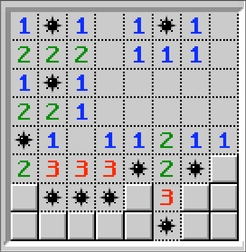

# flexbox-minesweeper

## Challenge learning about using Flexbox 

I have to make a minesweeper in a static moment of the game, similar to the one displayed below.

https://mirodeon.github.io/flexbox-minesweeper/

---
